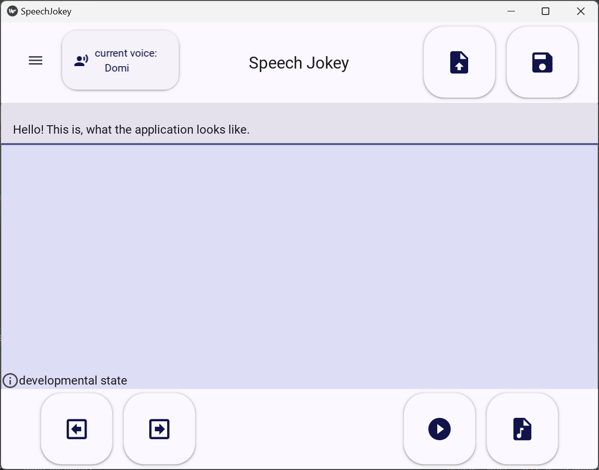
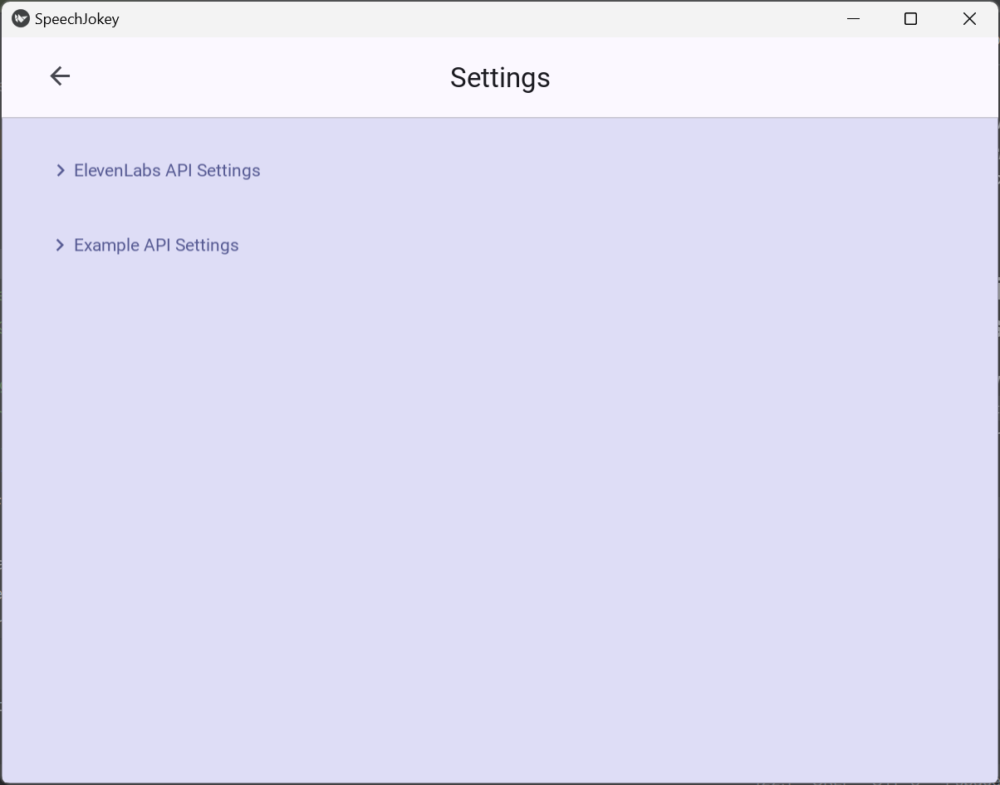

# Speech Jokey

Speech-Jokey is a speech synthesis application with prosody parametrization for eye-tracking users.

* Main features and objectives
  * Creation of synthesized audio using various speech APIs
  * Optimized for Eye-Tracking users (PwD: Cerbral Palsy,...)
  * Simplified input of prosody parametrization to change parameters like pitch, speaking rate, or emotion of generated audio.

## Demo video

[Demo video of the speech jokey program](https://www.youtube.com/watch?v=V3vPxYFN38s) showing the generation of synthetic speech using the Elevenlabs API.

## Install and Run

1. Download and extract the [current release](https://github.com/inclusion-international/speech-jokey/releases).
2. Double-click onto speech-jokey.exe (or the respective command for your OS)

## Developer documentation

Please read the [developer documentation](./doc/developer.md) which describes how to locally install and run the program.

## User documentation

This is what the application currently looks like.

### Main screen

### Settings dialog

## Speech Provider

The application currently supports the following speech synthesis providers:
* [ElevenLabs API](https://elevenlabs.io/api)
* [OpenAI](https://platform.openai.com/docs/guides/text-to-speech/overview)
* [Amazon Polly](https://aws.amazon.com/de/polly/)
* [Microsoft Azure](https://speech.microsoft.com/portal)
* [gTTS](https://pypi.org/project/gTTS/)
* [Ofai](https://demo.ofai.at/speech/?view=api)

### ElevenLabs
ElevenLabs Speech Synthesis is an online TTS API and transforms written text into highly realistic speech by analyzing context and emotion, 
adjusting intonation and pacing accordingly. It supports over 30 languages, enabling users to generate lifelike audio 
content across diverse linguistic contexts.

To create an API-Key, create an ElevenLabs account, click on "My Account" > "API Keys" > "Create API Key". 
Copy the API key and paste it in the settings of the Speech-Jokey app. The free tier has 10,000 credits per month (~10 min audio).

### OpenAI
OpenAI's online Text-to-Speech API converts written text into natural-sounding spoken language using the latest advances in machine learning.
To create an API-Key, create an OpenAI account, go to the [OpenAI website](https://platform.openai.com/docs/guides/text-to-speech/quickstart), click on "Your profile" in the upper right corner, click on "API Keys" > "Create new secret key".
Copy the API key and paste it in the settings of the Speech-Jokey App. 

OpenAI TTS has no free tier, there has to be added a credit balance with a credit or debit card.
The pricing is $0.015 per 1000 characters with the tts−1 model and $0.030 per 1000 characters with tts-1-hd. 
Unfortunately, OpenAI TTS does not have support for SSML or any prosody parametrization.

### Amazon Polly
Amazon Polly is a cloud-based service provided by Amazon Web Services (AWS) that uses advanced deep learning technologies 
to convert text into lifelike speech. It enables developers to integrate speech synthesis into their applications, making them more engaging and accessible.

To start, go to the [Amazon Polly Website](https://aws.amazon.com/de/polly/), click on "Get started with Amazon Polly" and create an account.
Go to the [Aws console](https://us-east-1.console.aws.amazon.com/iam/home?region=us-east-1#/security_credentials) and click on "Create API Key". You will see two keys:
A normal access key and a secret access key. Together with your preferred region (e.g eu-north-1) copy the credentials and paste them in the settings of the
Speech-Jokey app.

Amazon Polly has a 12-month trial phase in which 5 million characters for standard voices and 1 million characters for neural voices per month are free.
After the free trial or outside of the free quota, Amazon Polly standard voices are charged $4 and neural voices with $16 per 1 million characters.

Amazon Polly has [support for some SSML tags](https://docs.aws.amazon.com/polly/latest/dg/supportedtags.html) like break, emphasis, lang,
prosody or say-as. 

### Microsoft Azure
Microsoft Azure Text-to-Speech online API supports Neural Text-to-Speech (Neural TTS), which enhances pronunciation, prosody, and overall voice quality. The API includes over 500 voices.

Create a Microsoft Azure Account and follow the steps of [this guide](https://docs.merkulov.design/how-to-get-microsoft-azure-tts-api-key/)
to create a speech resource. On the site https://portal.azure.com/#home you can see your resources. Click on your text-to-speech resource and copy and paste your
key and region into the settings of the Speech-Jokey app. The free subscription (F0) has 0.5 million characters free per month, the Standard (S0) is a pay-as-you-go service
and TTS costs $15 per 1M characters.

Microsoft Azure supports a [wide range of SSML content](https://learn.microsoft.com/de-de/azure/ai-services/speech-service/speech-synthesis-markup-voice) where each voice has their own
[supported styles](https://learn.microsoft.com/nb-no/azure/ai-services/speech-service/language-support?tabs=tts#voice-styles-and-roles).

### gTTS
Google Text-to-Speech (gTTS) is a Python library and command-line utility that allows developers to convert text into speech using Google's Text-to-Speech online API
without the need of an API-Key or a subscription. gTTS does not support SSML or prosody parametrization.

### Ofai
Ofai is a TTS for Austrian dialects developed by the Austrian Research Institute for Artificial Intelligence (OFAI) that is specifically designed to handle Austrian German dialects.
It is an online API and does not need an API-Key or subscription. Ofai does not support SSML or prosody parametrization.

## Editing the text
To simplify editing the text, the cursor set via eye tracker is always placed at the end of a word. To move the cursor one position to the left or right, the user can use the arrow buttons at the bottom left of the application.

The editing feature is addressed especially to people who need eye tracking devices to move the cursor. 

## Selecting voice
The voice can be selected using the voice selection button or in the settings. All available voices are listed. 
On the selection of a voice a Popup will appear and the selected voice is displayed. 

The currently selected voice is always displayed on the voice selection button.

Using the voice selection button:

## Use Emojis as SSML tags 

## Prosody parametrization

Several simplified textual shortcuts can be used to parametrize the prosody of the generated audio.

### Pause

The following punctuation marks can be used to add a speaking pause between words:

* , adds a break of 0.0s
* . adds a break of 0.5s
* ; adds a break of 0.5s

## Synthesizing audio 
An audio file is generated using the synthesizing button. 

## Playing audio
Before playing the audio file, an audio file has to be synthesized using the synthesizing button.

The file can then be played with the play button.

## Saving the text file 
The final version of the edited text can be saved as a text file.

## Setting up Speech Provider

To setup a speech provider (e.g. ElevenLabs) the API Key must be entered in the respective settings dialog.
Please check the documenation of your speech provider to get an API key.

